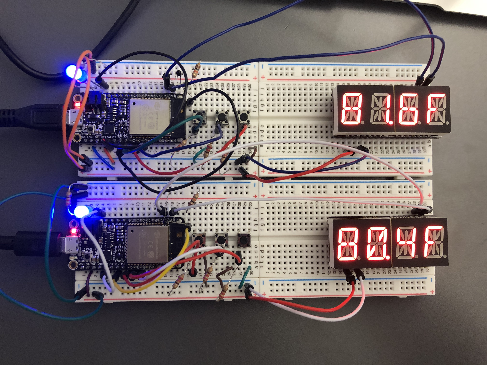
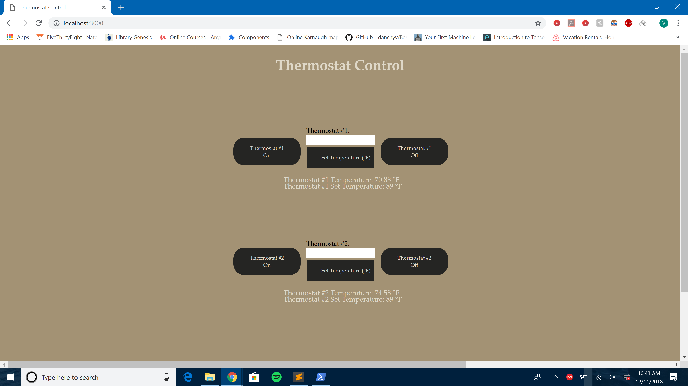

# Smart-Thermostat-System
CHANGED
For this project, we created a system of smart thermostats that could be controlled from both a web client and on the device. Through HTTP get and put requests we are able to monitor and change the settings of the devices from the web client over wifi. 

 Thermostat Devices :

 Web Client :

